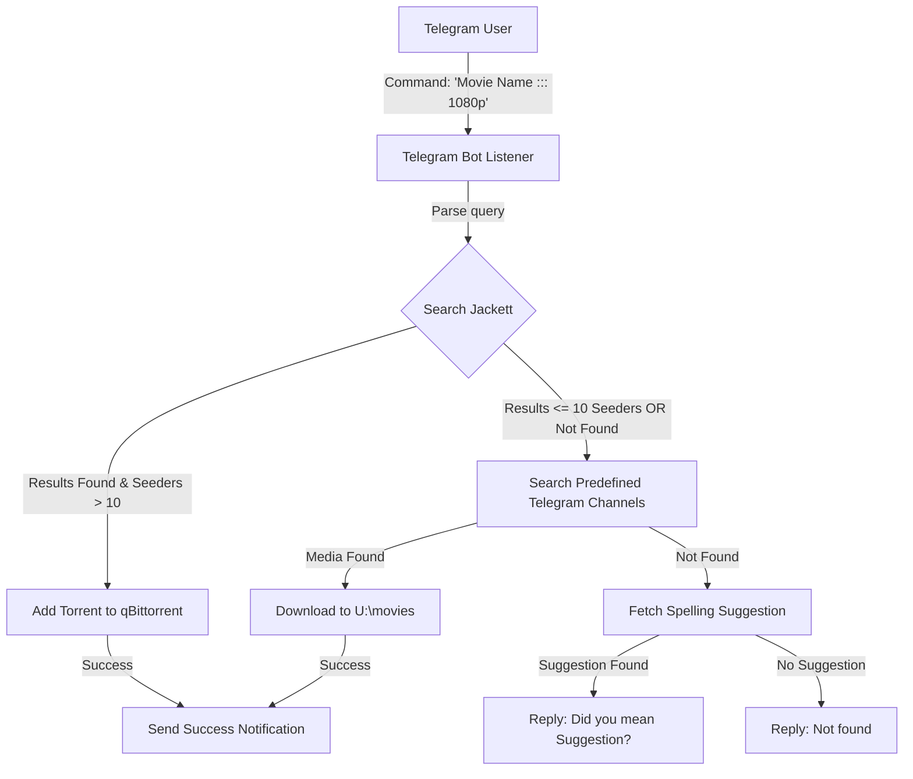

# Hybrid Media Downloader Bot

A production-ready hybrid media downloader bot that integrates **Jackett** (torrent search), **qBittorrent** (torrent downloading), and **Telegram (via Telethon)** (for commands and direct file downloading from channels).

---

## How It Works



1. **User Command**: The bot listens for messages (e.g., `Hotel Transylvania ::: 1080p` or just `Hotel Transylvania`).
2. **Jackett Search**: It queries Jackett for torrents.
3. **Seeder Evaluation**:
   - If a torrent result is found with **more than 10 seeders**, the bot grabs the magnet link and adds it to **qBittorrent** to save in `U:\movies`.
   - If seeders are **10 or fewer** (or no torrents are found), the bot falls back to searching predefined Telegram channels.
4. **Telethon Fallback**: It searches configured Telegram channels for matches containing all the title keywords (and quality, if specified). If a matching video/document is found, it downloads it directly to `U:\movies`.
5. **Spelling Auto-Correction**: If the query fails to yield any results in both Jackett and Telegram, the bot automatically checks DuckDuckGo's autocomplete API for spelling suggestions and replies: *"Did you mean: **Hotel Transylvania**?"*

---

## Directory Structure

```text
C:\Users\ujwal\Documents\media remote downloader\
├── bot.py                # Main bot application
├── test_download.py      # Automated integration testing script
├── Dockerfile            # Packaging description for python container
├── docker-compose.yml    # Combined bot, qBittorrent, and Jackett services
├── requirements.txt      # Python dependencies
├── .env.example          # Environment template
└── .env                  # Your actual configurations (git-ignored)
```

---

## Prerequisites & Installation

### Step 1: Clone or Copy files
Ensure all files are placed in `C:\Users\ujwal\Documents\media remote downloader`.

### Step 2: Configure Environment Variables
Copy `.env.example` to `.env`:
```bash
copy .env.example .env
```
Open `.env` and fill in the values:
- **`TELEGRAM_API_ID` & `TELEGRAM_API_HASH`**: Obtain these from [my.telegram.org](https://my.telegram.org) under API Development Tools.
- **`TELEGRAM_BOT_TOKEN`**: (Optional) Get this from [@BotFather](https://t.me/BotFather) if you want the listener to run as a Bot account. If left blank, the bot runs as a Telegram User account (which requires interactive OTP login on first start).
- **`TELEGRAM_CHANNELS`**: Comma-separated list of Telegram channel usernames (e.g. `@my_channel`) or IDs (e.g. `-100123456789`) to search.
- **`JACKETT_API_KEY`**: Obtain this from your Jackett Web UI dashboard.
- **`QBITTORRENT_URL`**, **`QBITTORRENT_USERNAME`**, **`QBITTORRENT_PASSWORD`**: Your qBittorrent login settings.
- **`DOWNLOAD_DIR`**: The default download path. On Windows, this defaults to `U:\movies`. Inside Docker, this maps internally to `/downloads` (which is volume-mounted to `U:\movies` on the host).

---

## How to Run

### Method A: Docker Desktop (Recommended)

1. Open a terminal in the project directory:
   ```powershell
   cd "C:\Users\ujwal\Documents\media remote downloader"
   ```
2. Build and run the services in the background:
   ```powershell
   docker compose up -d
   ```
   This will spin up three containers:
   - **`media_downloader_bot`** (Python bot)
   - **`qbittorrent`** (accessible at `http://localhost:8080` with default credentials `admin` / `adminadmin`)
   - **`jackett`** (accessible at `http://localhost:9117`)

3. **Telegram Setup Authentication (First Time Only)**:
   - If running as a **User Account** (instead of a Bot Token), the Telethon client needs your login authorization.
   - Attach to the running bot container to enter your phone number and OTP code:
     ```powershell
     docker attach media_downloader_bot
     ```
   - Enter your phone number (e.g., `+1234567890`) and the login code Telegram sends you.
   - Once successfully logged in, press `Ctrl + P` then `Ctrl + Q` to safely detach from the container console without stopping it.
   - The session file `media_downloader_session.session` is saved directly in the project directory and will persist across container restarts.

---

### Method B: Running Locally (Bare Metal)

1. Install Python 3.10+ and PIP.
2. Install dependencies:
   ```powershell
   pip install -r requirements.txt
   ```
3. Run the automated integration test to verify configuration:
   ```powershell
   python test_download.py
   ```
4. Start the bot:
   ```powershell
   python bot.py
   ```

---

## Usage Guide

- **Private Chat**: Send a message directly to your Telegram bot / user account.
  - Formats:
    - `Hotel Transylvania ::: 1080p` (queries Jackett for "Hotel Transylvania 1080p" first)
    - `Hotel Transylvania` (queries Jackett for "Hotel Transylvania")
- **Groups/Channels**: If you add the bot to a group chat, trigger it by typing:
  - `/download Hotel Transylvania ::: 1080p`
  - `/download Hotel Transylvania`

---

## Important Configuration Notes

- **Telegram Channels Search Permissions**:
  - **As a Bot Account**: If you use `TELEGRAM_BOT_TOKEN`, the bot **must** be added as an Administrator in the preconfigured channels to read and search their history.
  - **As a User Account**: Your user account must simply be joined to the channels you want to search.
- **Unified Save Location**:
  - Torrent files added to qBittorrent will be assigned the save path configured in `DOWNLOAD_DIR`.
  - Directly downloaded media files from Telegram channels will also be saved directly to `DOWNLOAD_DIR`.
  - Both map to the same directory on the host (e.g., `U:\movies`).
